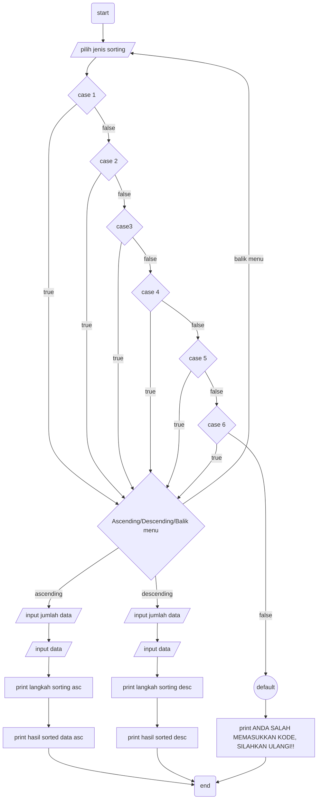

```mermaid
flowchart TD;

A(start) --> B[/pilih jenis sorting/];
B --> C{case 1};
C --true-->D{Ascending/Descending/Balik menu};
D--ascending--> F[/input jumlah data/];
F-->G[/input data/];
G-->H[print langkah sorting asc];
H --> i[print hasil sorted data asc]

D--descending--> J[/input jumlah data/];
J-->K[/input data/];
K --> L[print langkah sorting desc];
L-->M[print hasil sorted desc];


C --false--> E{case 2}
E--true-->D;
E--false-->N{case3};

N--true-->D;
N--false-->O{case 4};
O--true-->D;
O--false-->P{case 5};
P--true-->D;
P--false-->Q{case 6};
Q--true--> D;
Q --false-->R((default));
R -->S[print ANDA SALAH MEMASUKKAN KODE, SILAHKAN ULANGI!!]

D --balik menu--> B
i & M & S --> T(end);


```